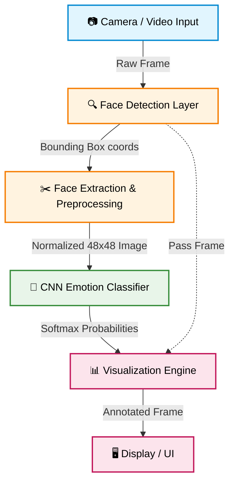

<p align="center">
  
</p>

<h1 align="center">📘 FaceSentrix — Real-Time Emotion Recognition System</h1>

<p align="center">
  <b>Advanced Face Detection & Emotion Classification Pipeline</b><br/>
  <i>Powered by 🐍 Python · 👁️ OpenCV · 🧠 Deep Learning (CNN)</i>
</p>

<p align="center">
  
  
  
  
  
</p>

---

## 🌟 Project Overview

**FaceSentrix** is a highly interactive, real-time emotion detection system designed to identify human faces from live camera feeds (or videos/images) and classify their emotional states using a meticulously optimized Convolutional Neural Network (CNN).

### 🎯 Core Objectives

| # | Objective | Description |
|---|-----------|-------------|
| 1 | 📸 **Face Detection** | Real-time face localization using OpenCV (Haar Cascades / DNN). |
| 2 | 🧠 **Emotion Classification** | Categorizes expressions into **Happy, Sad, Angry, Surprise, Fear, Disgust, Neutral**. |
| 3 | ⚡ **Low Latency** | Optimized for smooth, live camera feed processing (target: ≥15-30 FPS). |
| 4 | 📊 **Visual Feedback** | Dynamic bounding boxes with confidence meters and labels overlaid on faces. |
| 5 | 🚀 **Scalable Pipeline** | End-to-end framework: Data Preparation → Augmentation → Training → Inference. |

---

## 🏗️ Interactive System Architecture

The architecture of FaceSentrix leverages a streamlined data flow ensuring minimal latency from capture to classification.



---

## 🧰 Technology Stack

<div align="center">
  <table>
    <tr>
      <td align="center" width="25%"><b>Language</b><br><br/>Python 3.8+</td>
      <td align="center" width="25%"><b>Computer Vision</b><br><br/>OpenCV 4.x</td>
      <td align="center" width="25%"><b>Deep Learning</b><br><br/>TensorFlow / Keras</td>
      <td align="center" width="25%"><b>Data Science</b><br><br/>NumPy, Pandas</td>
    </tr>
  </table>
</div>

---

## 📊 Emotion Classes

FaceSentrix is trained to recognize the 7 universal facial expressions.

| Emotion | Visual | Description | Application Example |
|---------|:---:|-------------|-----------------|
| **Angry** | 😡 | Eyebrows down, lips pressed | Customer frustration tracking |
| **Disgust**| 🤢 | Wrinkled nose, raised upper lip | Product reaction testing |
| **Fear** | 😨 | Raised eyebrows, tensed lips | Safety & threat assessment |
| **Happy** | 😊 | Smiling, raised cheeks | UX & Satisfaction monitoring |
| **Sad** | 😢 | Frowning, lowered eyes | Mental well-being screening |
| **Surprise**| 😮 | Widened eyes, open mouth | Content engagement metrics |
| **Neutral**| 😐 | Relaxed facial muscles | Baseline behavioral context |

---

## 📁 Project Structure

```bash
FaceSentrix/
├── 📄 README.md                  # Main project README
├── 📄 LICENSE                    # CC0 1.0 Universal License
├── 📄 .gitignore                 # Git ignore rules
├── 📄 requirements.txt           # Python dependencies
├── 📂 data/                      # Dataset handling (raw & processed)
├── 📂 models/                    # Saved CNN models (.h5, .tflite)
├── 📂 src/                       # Core Source Code (Detector, Classifier, Visualizer)
├── 📂 training/                  # Training scripts and preprocessing
├── 📂 notebooks/                 # Jupyter exploration & analysis notebooks
├── 📂 tests/                     # Unit & integration testing
├── 📂 assets/                    # Project visual assets
├── 📂 docs/                      # Extensive internal documentation
└── 📂 app/                       # Deployment apps (Web/API)
```

---

## 🔗 Deep-Dive Documentation

For detailed insights into specific parts of the project, check out our comprehensive docs:

- 👉 [**Project Roadmap (TODO)**](./docs/TODO.md): Step-by-step feature tracker.
- 👉 [**System Architecture**](./docs/ARCHITECTURE.md): Deep dive into data flow and module design.
- 👉 [**Model Design**](./docs/MODEL_DESIGN.md): CNN structure, parameters, and tuning.
- 👉 [**Dataset Guide**](./docs/DATASET_GUIDE.md): FER-2013 processing and imbalance handling.
- 👉 [**Deployment Options**](./docs/DEPLOYMENT.md): API, Web App, Docker, and Edge instructions.

---

## 🚀 Quick Start (Preview)

```bash
# 1. Clone the repository
git clone https://github.com/algorithnicmind/FaceSentrix.git
cd FaceSentrix

# 2. Setup Virtual Environment
python -m venv venv
source venv/bin/activate  # On Windows use: venv\Scripts\activate

# 3. Install Dependencies
pip install -r requirements.txt

# 4. Run the Real-Time Camera Detection
python src/camera.py
```

---

## 🛠️ Contribution & Development Philosophy

FaceSentrix follows a rigorous **"commit-per-change"** workflow. Every logical step, file creation, or code adjustment is isolated into its own granular git commit. This method ensures an atomic, reversible, and highly readable development history. 

---

<p align="center">
  
</p>
<p align="center">
  <b>Built with ❤️ by <a href="https://github.com/algorithnicmind">AlgorithmicMind</a></b>
</p>
